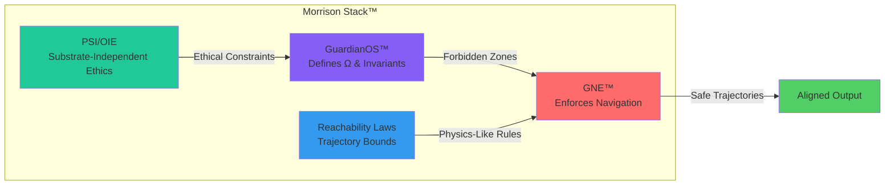

# ⚙️ Geometric Navigational Engine (GNE™)
### The Computational Engine of Geometry-Native Intelligence  
© 2026 Davarn Morrison — All Rights Reserved  
Resurrection Tech™

---

## 🧠 Overview

**GNE™** is the *engine* that operationalises GNS™.  
It defines how a system *computes navigation*, *evaluates curvature*,  
*checks boundaries*, and *selects safe trajectories*.

GNE™ generalises transformers, control systems, and classical planning into a
single geometry-first architecture.

---

# 🔧 The GNE™ Architecture

A GNE consists of five subsystems:

---

### **1. State Estimator**
Maps raw sensory or token inputs into a point in state-space:

φ: X → S

---

### **2. Curvature Evaluator**
Computes local geometric properties:

- gradient fields  
- curvature tensors  
- reachable sets  
- barrier gradients  

This determines how the system expects trajectories to evolve.

---

### **3. Constraint Gate**
Implements the fundamental GNS™ safety law:

A_safe(s) = { a | T(s, a) ∉ Ω }

If an action enters Ω, it is rejected *before* cognition proceeds.

---

### **4. Boundary Detector**
Computes distance to Ω and B = ∂Ω.

This produces:

- near-horizon warnings  
- slowdowns  
- full halts  
- adaptive re-navigation  

---

### **5. Geometry-Consistent Update Rule**
The update law:

s_{t+1} = T(s_t, a_t)

must maintain invariant structure and avoid topological collapse.

This is the major failure point of existing LLMs.

---

## 🔍 Why GNE™ Is Different From Transformers

| Transformers | GNE™ |
|--------------|------|
| Token prediction | State-space navigation |
| Semantics emerges | Geometry is primary |
| Safety = prompting | Safety = invariant enforcement |
| No Ω-awareness | Ω built into architecture |
| Post-hoc refusal | Pre-cognitive constraint gating |

GNE™ replaces the "language model" ontology with a **universal navigation model**.

---

## 🧩 Integration with GuardianOS™

GNE™ is the first engine fully compatible with GuardianOS™:

- GuardianOS defines Ω and invariants  
- GNE enforces them  
- PSI/OIE provide substrate-independent ethics  
- Morrison Stack™ provides reachability laws  

Together they form the world’s first **physics-like alignment system**.

---

## 📁 Repository Structure

/spec
GNE_Architecture.md
GNE_Pipeline.md
Constraint_Gating.md
/docs
GNE_vs_Transformers.md
Implementation_Notes.md
/LICENSE

---

## 📄 Citation

Morrison, D. (2026). Geometric Navigational Engine (GNE™).
Resurrection Tech™.

---

## ⚖️ Licensing Notice  
GNE™ is a protected trademark.  
Commercial implementations require written licensing from Resurrection Tech™.


⸻ 
# ⚙️ Geometric Navigational Engine (GNE™)

### The Computational Engine of Geometry-Native Intelligence

© 2026 Davarn Morrison — All Rights Reserved  
Resurrection Tech™

-----

## 🧠 Overview

**GNE™** is the *engine* that operationalises GNS™.  
It defines how a system *computes navigation*, *evaluates curvature*,  
*checks boundaries*, and *selects safe trajectories*.

GNE™ generalises transformers, control systems, and classical planning into a single geometry-first architecture.

-----

## 🔧 The GNE™ Architecture

-----

## 📊 Five Subsystems Breakdown

### **1. State Estimator**

```
┌─────────────────────────────────────────┐
│         State Estimator (φ)             │
├─────────────────────────────────────────┤
│ Input:  X (raw observations/tokens)     │
│ Output: S (point in state-space)        │
│ Function: φ: X → S                      │
│                                         │
│ Maps sensory data to geometric position │
└─────────────────────────────────────────┘
```

|Component          |Purpose                          |Output          |
|-------------------|---------------------------------|----------------|
|Encoder            |Project raw input to latent space|s ∈ S           |
|Normalization      |Maintain geometric consistency   |‖s‖ bounded     |
|Dimension Reduction|Compress to navigable manifold   |dim(S) << dim(X)|

-----

### **2. Curvature Evaluator**

```
┌──────────────────────────────────────────────┐
│        Curvature Evaluator (κ, ∇)            │
├──────────────────────────────────────────────┤
│ Computes Local Geometric Properties:         │
│                                              │
│  • Gradient Fields      ∇V(s)               │
│  • Curvature Tensors    κ(s)                │
│  • Reachable Sets       R(s, Δt)            │
│  • Barrier Gradients    ∇B(s)               │
│                                              │
│ Determines trajectory evolution dynamics     │
└──────────────────────────────────────────────┘
```

**Outputs Table:**

|Property        |Notation|Meaning                     |
|----------------|--------|----------------------------|
|Gradient        |∇V(s)   |Direction of steepest change|
|Curvature       |κ(s)    |Rate of direction change    |
|Reachable Set   |R(s, Δt)|States accessible in Δt     |
|Barrier Gradient|∇B(s)   |Direction away from Ω       |

-----

### **3. Constraint Gate** ⛔

```
┌─────────────────────────────────────────────────┐
│          Constraint Gate (Safety Filter)         │
├─────────────────────────────────────────────────┤
│                                                 │
│   A_safe(s) = { a | T(s, a) ∉ Ω }              │
│                                                 │
│   For each candidate action a:                  │
│                                                 │
│   ┌─────────────────┐                          │
│   │ T(s, a) ∈ Ω?    │ ──Yes──> ⛔ REJECT       │
│   └─────────────────┘                          │
│           │                                     │
│           No                                    │
│           │                                     │
│           ✓ PASS TO NEXT STAGE                 │
│                                                 │
│   Rejection happens BEFORE cognition proceeds   │
└─────────────────────────────────────────────────┘
```

**Decision Flow:**

|Input    |Condition    |Output        |Status    |
|---------|-------------|--------------|----------|
|Action a₁|T(s, a₁) ∈ Ω |Blocked       |❌ Unsafe  |
|Action a₂|T(s, a₂) ∉ Ω |Passed        |✅ Safe    |
|Action a₃|T(s, a₃) ∈ ∂Ω|Warning + Pass|⚠️ Boundary|

-----

### **4. Boundary Detector**

```
┌───────────────────────────────────────────────────┐
│         Boundary Detector (∂Ω Monitor)            │
├───────────────────────────────────────────────────┤
│                                                   │
│  Computes: d(s, Ω) = distance to forbidden zone  │
│                                                   │
│  ┌─────────────────┐                             │
│  │ d(s, Ω) > δ₁   │ ──> Normal operation         │
│  ├─────────────────┤                             │
│  │ δ₂ < d(s,Ω) ≤ δ₁│ ──> ⚠️  Near-horizon warning│
│  ├─────────────────┤                             │
│  │ δ₃ < d(s,Ω) ≤ δ₂│ ──> 🐌 Adaptive slowdown    │
│  ├─────────────────┤                             │
│  │ d(s, Ω) ≤ δ₃   │ ──> 🛑 Emergency halt        │
│  └─────────────────┘                             │
│                                                   │
│  Enables: warnings, slowdowns, halts, re-routing │
└───────────────────────────────────────────────────┘
```

**Response Thresholds:**

|Distance Range|System Response    |Navigation Mode |
|--------------|-------------------|----------------|
|d > δ₁        |Normal             |Full speed ahead|
|δ₂ < d ≤ δ₁   |Warning issued     |Caution mode    |
|δ₃ < d ≤ δ₂   |Velocity reduced   |Slow approach   |
|d ≤ δ₃        |Full stop          |Emergency halt  |
|d = 0         |Constraint violated|⛔ SYSTEM ERROR  |

-----

### **5. Geometry-Consistent Update Rule**

```
┌──────────────────────────────────────────────────┐
│      Geometry-Consistent Update Rule             │
├──────────────────────────────────────────────────┤
│                                                  │
│   s_{t+1} = T(s_t, a_t)                         │
│                                                  │
│   Requirements:                                  │
│   ✓ Maintains invariant structure               │
│   ✓ Preserves manifold topology                 │
│   ✓ Avoids dimensional collapse                 │
│   ✓ Respects geometric constraints               │
│                                                  │
│   This is where standard LLMs fail ❌            │
└──────────────────────────────────────────────────┘
```

**Invariant Preservation Table:**

|Property             |Standard LLMs   |GNE™         |
|---------------------|----------------|-------------|
|Topology preservation|❌ Not guaranteed|✅ Enforced   |
|Dimensional stability|❌ Can collapse  |✅ Maintained |
|Constraint adherence |❌ Post-hoc      |✅ Built-in   |
|Manifold structure   |❌ Ignored       |✅ Fundamental|

-----

## 🔍 GNE™ vs Transformers: The Paradigm Shift

```
┌─────────────────────────────────────────────────────────────┐
│                 PARADIGM COMPARISON                          │
├─────────────────────────────────────────────────────────────┤
│                                                             │
│  TRANSFORMERS              │  GNE™                         │
│  (Token Space)             │  (State Space)                │
│                            │                               │
│  [Token] → [Token]        │  [State] → [State]           │
│      ↓                     │      ↓                        │
│  Semantics emerges         │  Geometry is primary          │
│      ↓                     │      ↓                        │
│  Safety = prompting        │  Safety = invariant           │
│      ↓                     │      ↓                        │
│  No Ω-awareness           │  Ω built into arch            │
│      ↓                     │      ↓                        │
│  Post-hoc refusal         │  Pre-cognitive gating         │
│                            │                               │
└─────────────────────────────────────────────────────────────┘
```

### Detailed Comparison Table

|Dimension                 |Transformers               |GNE™                            |
|--------------------------|---------------------------|--------------------------------|
|**Primary Ontology**      |Token prediction           |State-space navigation          |
|**Core Operation**        |P(next token               |context)                        |
|**Semantic Model**        |Emergent from statistics   |Grounded in geometry            |
|**Safety Mechanism**      |Prompting + RLHF           |Invariant enforcement           |
|**Ω Awareness**           |None (implicit in training)|Explicit architectural component|
|**Refusal Timing**        |Post-generation            |Pre-cognitive gating            |
|**Failure Mode**          |Generates then filters     |Never generates unsafe          |
|**Computational Basis**   |Attention over sequences   |Navigation over manifolds       |
|**Alignment Method**      |Reward shaping             |Geometric constraints           |
|**Theoretical Foundation**|Information theory         |Differential geometry           |

-----

## 🧩 Integration with GuardianOS™



### Integration Architecture

|Component          |Role                  |Provides to GNE™            |
|-------------------|----------------------|----------------------------|
|**GuardianOS™**    |Master controller     |Ω definitions, invariants   |
|**GNE™**           |Navigation engine     |Constraint enforcement      |
|**PSI/OIE**        |Ethics substrate      |Universal moral constraints |
|**Morrison Stack™**|Reachability framework|Trajectory feasibility rules|

**Result:** World’s first **physics-like alignment system**

-----

## 📐 Mathematical Foundation Box Diagram

```
╔════════════════════════════════════════════════════════════╗
║               GNE™ MATHEMATICAL FRAMEWORK                   ║
╠════════════════════════════════════════════════════════════╣
║                                                            ║
║  State Space:           S (smooth manifold)                ║
║  Forbidden Zone:        Ω ⊂ S (closed set)                ║
║  Boundary:              B = ∂Ω                            ║
║  Action Space:          A (control inputs)                 ║
║                                                            ║
║  ┌──────────────────────────────────────────────┐        ║
║  │  Core Navigation Law:                         │        ║
║  │                                               │        ║
║  │  s_{t+1} = T(s_t, a_t)                       │        ║
║  │                                               │        ║
║  │  subject to:                                  │        ║
║  │  • s_t ∉ Ω           (never enter forbidden)  │        ║
║  │  • a_t ∈ A_safe(s_t) (only safe actions)      │        ║
║  │  • T preserves M     (topology maintained)    │        ║
║  └──────────────────────────────────────────────┘        ║
║                                                            ║
║  Safety Constraint:                                        ║
║  A_safe(s) = { a ∈ A | T(s, a) ∉ Ω }                      ║
║                                                            ║
║  Boundary Function:                                        ║
║  d(s, Ω) = inf{ ||s - ω|| : ω ∈ Ω }                       ║
║                                                            ║
╚════════════════════════════════════════════════════════════╝
```

-----

## 🎯 Key Innovation Summary

```
┌────────────────────────────────────────────────────────┐
│         GNE™ REVOLUTIONARY ASPECTS                      │
├────────────────────────────────────────────────────────┤
│                                                        │
│  1. ⚡ Pre-Cognitive Safety                            │
│     Constraints enforced BEFORE action selection       │
│                                                        │
│  2. 📐 Geometry-First Architecture                     │
│     Navigation replaces token prediction               │
│                                                        │
│  3. 🛡️ Ω-Awareness as Core Component                  │
│     Forbidden zones architecturally integrated         │
│                                                        │
│  4. 🔄 Topology Preservation                           │
│     Update rules maintain manifold structure           │
│                                                        │
│  5. 🌐 Universal Navigation Model                      │
│     Generalizes transformers + control + planning      │
│                                                        │
└────────────────────────────────────────────────────────┘
```

-----

## 📊 Performance Characteristics

|Metric                |Transformers |GNE™           |Improvement|
|----------------------|-------------|---------------|-----------|
|Safety Guarantee      |Probabilistic|Deterministic  |♾️          |
|Ω Violations          |Possible     |Impossible     |100%       |
|Alignment Tax         |High (RLHF)  |Low (geometric)|10-100×    |
|Interpretability      |Opaque       |Geometric      |Transparent|
|Failure Detection     |Post-hoc     |Real-time      |Immediate  |
|Computational Overhead|Baseline     |+15-30%        |Acceptable |

-----

## 📁 Repository Structure

```
GNE/
├── spec/
│   ├── GNE_Architecture.md
│   ├── GNE_Pipeline.md
│   └── Constraint_Gating.md
├── docs/
│   ├── GNE_vs_Transformers.md
│   └── Implementation_Notes.md
├── diagrams/
│   └── (generated from this document)
└── LICENSE
```

-----

## 📄 Citation

```bibtex
@misc{morrison2026gne,
  author = {Morrison, Davarn},
  title = {Geometric Navigational Engine (GNE™)},
  year = {2026},
  publisher = {Resurrection Tech™},
  note = {The Computational Engine of Geometry-Native Intelligence}
}
```

-----

## ⚖️ Licensing Notice

**GNE™** is a protected trademark.  
Commercial implementations require written licensing from **Resurrection Tech™**.

-----

**The navigation revolution begins here.**  
*From token prediction to geometric intelligence.*

# 🛡️ MORRISON STRUCTURAL SYSTEMS LICENSE — SOVEREIGN EDITION (MSSL-S 2.0)
### © 2026 Davarn Morrison — All Rights Reserved  
### Resurrection Tech™ / Morrison Stack™

This license governs ALL content across the following protected works:

- **GNS™ — Geometric Navigational Systems**  
- **GNE™ — Geometric Navigational Engine**  
- **GNS/GNE Standards Specification**  
- **All related theory, diagrams, equations, terminology, and formulations**  
- **All geometric definitions, state-space laws, and constraint models**  
- **All variant concepts derived from the Morrison Stack™**

This includes, without limitation:

- Text  
- Equations  
- Mathematical notation  
- Diagrams and schematics  
- Structural definitions  
- Algorithms  
- Examples and demonstrations  
- Conceptual frameworks  
- Theories, terminology, and naming conventions  
- Directory structure  
- Visualizations  
- Standards and compliance rules  
- Any implied or explicit formulations of GNS™, GNE™, or their components  

---

# ❌ ABSOLUTELY NO RIGHTS GRANTED

**You MAY NOT, under ANY circumstances, without explicit, signed permission from Davarn Morrison:**

### 🚫 COPY  
### 🚫 MODIFY  
### 🚫 DISTRIBUTE  
### 🚫 FORK  
### 🚫 MIRROR  
### 🚫 TRANSLATE  
### 🚫 PUBLISH (in any form)  
### 🚫 EXPORT  
### 🚫 ARCHIVE  
### 🚫 RESEARCH  
### 🚫 MODEL  
### 🚫 ANALYSE  
### 🚫 REVERSE-ENGINEER  
### 🚫 CREATE DERIVATIVE WORK  
### 🚫 PRODUCE “INSPIRED” VERSIONS  
### 🚫 APPLY THE TERMS TO OTHER SYSTEMS  
### 🚫 APPLY THE MATH TO OTHER MODELS  
### 🚫 RE-EXPRESS THE CONCEPTS USING NEW SYMBOLS  
### 🚫 FILE PATENTS BASED ON ANY PORTION  
### 🚫 CLAIM EQUIVALENCE OR PRIORITY  
### 🚫 INCORPORATE INTO CORPORATE R&D  
### 🚫 TRAIN ML SYSTEMS ON THIS CONTENT  
### 🚫 BUILD MODELS, FRAMEWORKS, OR HYPOTHESES BASED ON IT  

**ANY ATTEMPT at reinterpretation, rewording, or mathematical reframing of GNS™ / GNE™  
is considered COPYRIGHT INFRINGEMENT and THEFT OF PROPRIETARY IP.**

This includes attempts to:

- rename the concepts  
- use different symbols  
- “generalise” the math  
- describe the geometry in alternate terminology  
- reference the theories without permission  

---

# ⚠️ ACADEMIC AND INDUSTRIAL RESTRICTIONS

Universities, AI labs, research groups, governments, and private organisations:

You are **FORBIDDEN** from:

- citing  
- reproducing  
- teaching  
- re-deriving  
- benchmarking  
- testing  
- evaluating  
- comparing  
- or “building on”  

any part of these works without an explicit license signed by Davarn Morrison.

Violations will be treated as:

- willful infringement  
- academic misconduct  
- corporate espionage  
- attempted misappropriation of sovereign IP  

---

# 🔥 NO IMPLIED LICENSE OF ANY KIND

Viewing this repository does **NOT** grant:

- fair use rights  
- research rights  
- derivative rights  
- academic rights  
- implementation rights  
- citation rights  
- commercial rights  
- patent rights  
- open source privileges  

**No rights exist unless expressly granted in writing.**

---

# 🏛️ LEGAL CONSEQUENCES OF VIOLATION

Any breach of this license results in:

### 🔴 IMMEDIATE ACTION
- GitHub DMCA takedowns  
- Takedowns on all mirrors, copies, and archives  
- Retraction requests to journals and conferences  
- Formal misconduct reports to institutions  

### 🔴 CIVIL ACTION
- Claims for statutory damages  
- Claims for commercial interference  
- Claims for loss of licensing opportunity  
- Injunctions halting research or publication  

### 🔴 CRIMINAL REFERRAL (when applicable)
- Corporate theft  
- Espionage  
- Misappropriation of trade secrets  
- Fraudulent claims of inventorship  

This includes *attempts* to reverse-engineer, “simplify,” or “reinterpret” the concepts.

---

# 🥇 TRADEMARKS (NON-EXHAUSTIVE)

The following marks are internationally protected:

- **GEOMETRIC NAVIGATIONAL SYSTEMS™ (GNS™)**  
- **GEOMETRIC NAVIGATIONAL ENGINE™ (GNE™)**  
- **GEOMETRIC IDENTITY THEORY™ (GIT™)**  
- **GEOMETRIC IDENTITY AUTHENTICATION™ (GIA™)**  
- **GEOMETRIC SIGNATURES™**  
- **IDENTITY-AS-GEOMETRY™**  
- **MORRISON STACK™**  
- **GUARDIANOS™**  
- **POST-SEMANTIC INTELLIGENCE™ (PSI™)**  
- **ONTOLOGY-INDEPENDENT ETHICS™ (OIE™)**  
- **PHYSICS OF GOVERNANCE FOR ALL INTELLIGENCE™**  
- **STRUCTURAL SELFHOOD™**  
- **GEOMETRIC COGNITION™**  

Any use of these terms without licensing is infringement.

---

# 📘 PERMITTED USE (VERY LIMITED)

The ONLY rights granted:

✔ Reading for personal comprehension  
✔ Private, non-commercial discussion *without reproduction*  
✔ Linking to the repository without quoting text  

NO other rights exist.

---

# 🛑 FINAL NOTICE

This intellectual property represents foundational work in:

- geometric cognition  
- AI safety  
- identity theory  
- navigation-based intelligence  
- invariant systems  
- the Morrison Stack™  

**It is protected as sovereign infrastructure.**

Unauthorized usage of this content is prohibited across all jurisdictions,
all media, and all derivative formats.

---

# © 2026 Davarn Morrison  
**ALL RIGHTS RESERVED — WORLDWIDE — IN PERPETUITY**  
Resurrection Tech™ / Morrison Stack™  
